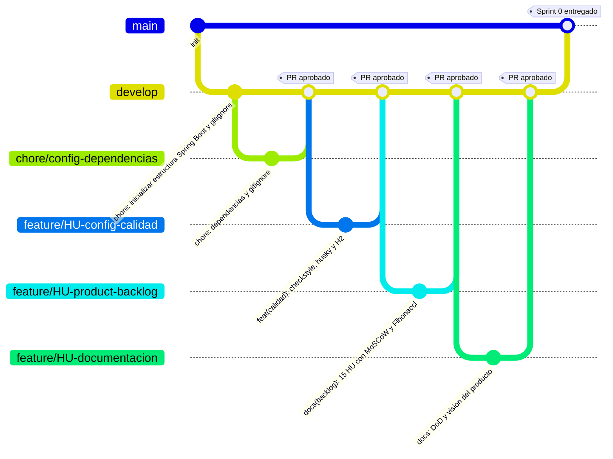

# AgroValle Connect


## 1. Declaración de la Visión del Producto

>**Para** los productores agrícolas del Valle del Cauca,
**Que** necesitan vender directo a sus compradores sin intermediarios excesivos,
>**AgroValle Connect** es una plataforma web desarrollada en Java / Spring Boot,
**Que** conecta la oferta y la demanda agrícola regional a precio justo,
>**A diferencia de** los intermediarios tradicionales de la cadena de comercialización,
**Nuestro producto** garantiza trazabilidad del pedido y contratos de API transparentes entre agricultores, comerciantes y transportistas.

El sistema busca resolver tres problemas estructurales: la intermediación excesiva que castiga el precio al productor, la falta de visibilidad en tiempo real de la oferta agrícola, y la ausencia de trazabilidad y coordinación logística en los despachos poscosecha.

## 2. Equipo

| Integrante | Rol |
|---|---|
| _Josen Julian Mina Carabali_ | Scrum Master |
| _Josue Mindineros Castillo_  | Backend / DevOps |
| _Lesly Camila Quintero Popo_ | Product Owner |
| _Yenni Liseth Obando Obando_ | QA / Documentador |

## 3. Estrategia de Ramas: GitFlow

### Justificación frente a GitFlow

El equipo eligió **GitFlow** porque el proyecto tiene entregas por sprint claramente delimitadas (evaluaciones del curso), lo que encaja con la separación que GitFlow hace entre una rama estable (`main`), una rama de integración continua del trabajo del equipo (`develop`) y ramas de vida corta para cada historia de usuario (`feature/*`). Esto minimiza los tiempos de espera y previene conflictos de fusión extensos porque:

- `main` siempre queda desplegable y corresponde exactamente a lo evaluado en cada sprint, evitando que código a medio terminar llegue a la entrega oficial.
- El trabajo de los 4 integrantes se integra en `develop` de forma incremental
- Cada Historia de Usuario queda aislada en su propia rama de vida corta, revisada por pares vía Pull Request antes de fusionarse

### Diagrama de la estrategia de ramas



### Convención de ramas

- `main`: código estable, correspondiente a cada entrega evaluada.
- `develop`: integración del trabajo de todo el equipo.
- `feature/HU0X-descripcion-corta`: una rama por Historia de Usuario 

### Convención de commits

- `feat:` nueva caracteristica
- `fix:` corrección de errores
- `docs:` cambios en la documentación
- `test:` agregar o corregir pruebas
- `chore:` tareas de mantenimiento

## 4. Stack técnico

- Java 17 — lenguaje de programación principal del backend
- Spring Boot — framework que facilita la creación de aplicaciones web.
- PostgreSQL — sistema de base de datos relacional.
- Maven — herramienta de gestión de dependencias.
- JUnit 5 — framework para escribir y ejecutar pruebas unitarias sobre la lógica de negocio.
- JaCoCo — herramienta que mide el porcentaje de cobertura de código cubierto por las pruebas unitarias.
- Checkstyle — herramienta de análisis estático que verifica que el código cumpla las reglas de estilo definidas

## 5. Cómo contribuir (flujo local)

```bash
git checkout develop
git pull origin develop
git checkout -b feature/HU0X-descripcion-corta
# ... trabajar y hacer commits semánticos ...
git push origin feature/HU0X-descripcion-corta
# Abrir Pull Request hacia develop, asignar 1-2 revisores, esperar aprobación
```
