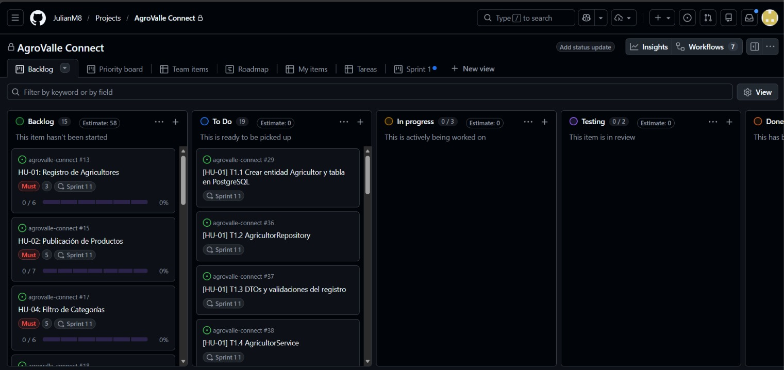
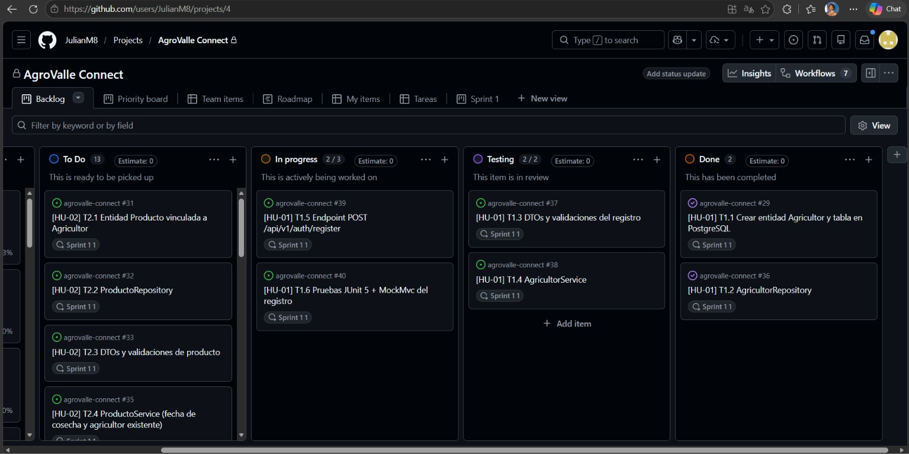
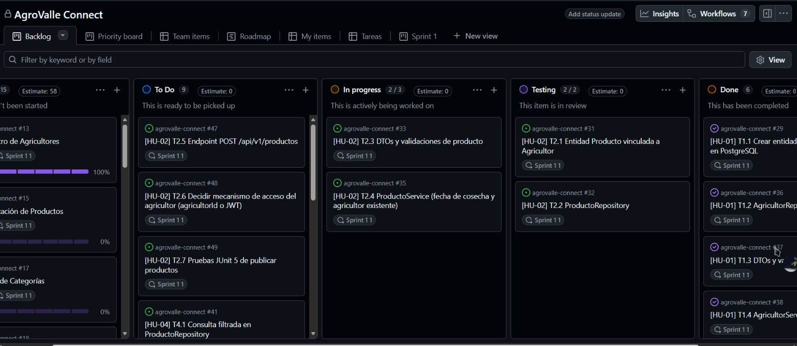
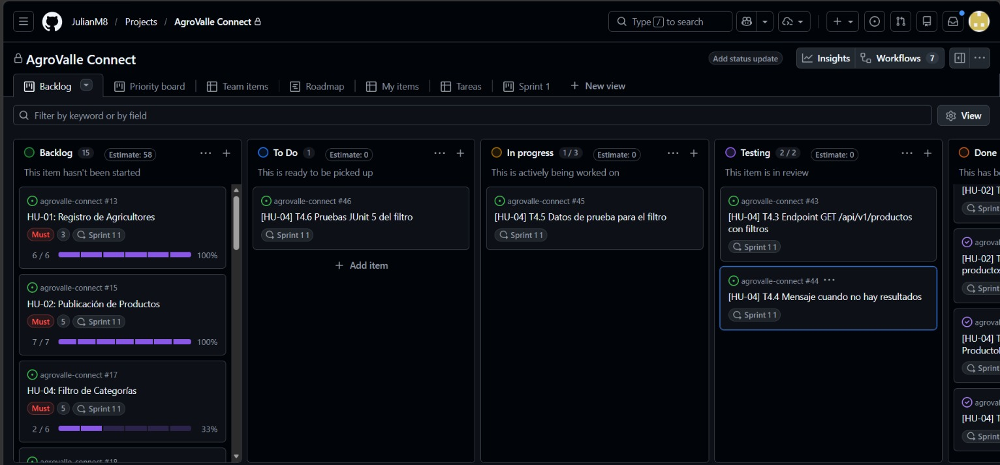

# Sprint Review — Sprint 1 — AgroValle Connect

**Fecha:** [30 de septiembre de 2026]
**Asistentes del equipo:** Julian Mina (Scrum Master), Josué Mindineros (Backend/DevOps), Lesly Quintero (Product Owner), Yenni Obando (QA/Documentador)

## 1. Sprint Goal

Habilitar el registro inicial de agricultores del Valle del Cauca, la publicación de sus cosechas en el inventario y la consulta filtrada dentro del catálogo agrícola, validando la persistencia en la base de datos y la arquitectura REST.

## 2. Historias comprometidas vs. completadas

| Historia | Estimación | Estado | Evidencia |
|---|---|---|---|
| HU-01: Registro de Agricultores | 3 pts | Completada | Endpoint `POST /api/v1/auth/register`, pruebas `AgricultorServiceTest` y `AgricultorControllerTest` |
| HU-02: Publicación de Productos | 5 pts | Completada | Endpoint `POST /api/v1/productos`, pruebas `ProductoServiceTest` y `ProductoControllerTest` |
| HU-04: Filtro de Categorías | 5 pts | Completada | Endpoint `GET /api/v1/productos?categoria=&municipio=`, prueba de repositorio `ProductoRepositoryTest` (con y sin coincidencias) |
| **Total** | **13 pts** | | |

## 3. Demostración funcional

Se realizo una pequeña demostracion en postman de las historias de usuario realizadas en el sprint 1

**Video demostrativo:** 
[Ver demuestracion](https://drive.google.com/file/d/1UDR1Sya7Gt9pDV_U5utef2_UHC1WBIR_/view?usp=drive_link)

1. **Registrar agricultor válido** → `POST /api/v1/auth/register` → respuesta **201 Created**, con el agricultor guardado en la tabla `agricultores` de PostgreSQL (verificado en pgAdmin).
2. **Registrar con identificación duplicada** → misma identificación del paso 1 → respuesta **409 Conflict**.
3. **Registrar con datos incompletos** (nombre vacío, correo inválido) → respuesta **400 Bad Request**.
4. **Publicar un producto** a nombre del agricultor registrado → `POST /api/v1/productos` → respuesta **201 Created**, con el producto guardado en la tabla `productos`, relacionado por `agricultor_id`.
5. **Publicar con un `agricultorId` inexistente** → respuesta **404 Not Found**.
6. **Publicar con fecha de cosecha anterior a hoy** → respuesta **400 Bad Request**.
7. **Filtrar productos por categoría y municipio con coincidencias** → `GET /api/v1/productos?categoria=Frutas&municipio=Palmira` → respuesta **200 OK**, con la lista de productos que cumplen ambos criterios.
8. **Filtrar sin coincidencias** → `GET /api/v1/productos?categoria=Verduras&municipio=Tuluá` → respuesta **200 OK**, con lista vacía y el mensaje "No hay proveedores del producto en ese municipio."
9. **Filtrar excluyendo productos sin unidades disponibles** → el servicio descarta productos con `cantidad` igual a 0, aunque coincidan en categoría y municipio.

## 4. Evidencia técnica (calidad)

- **Pipeline de CI (GitHub Actions, `ci.yml`):** ejecuta `./mvnw -B verify` en cada Pull Request hacia `develop`. Verificado en verde tras corregir la conexión inicial a PostgreSQL y una falla temporal de descarga del wrapper de Maven.
- **Checkstyle:** 0 violaciones en la última ejecución exitosa, tras corregir 2 líneas superiores a 120 caracteres en `ProductoPublicacionRequest` y una regla de separación de líneas en `ProductoService`.
- **Cobertura (JaCoCo):** por encima del mínimo de 60 % requerido, alcanzado incorporando pruebas de servicio (`AgricultorServiceTest`, `ProductoServiceTest`), de controlador (`AgricultorControllerTest`, `ProductoControllerTest`) con MockMvc, y de repositorio (`ProductoRepositoryTest`) con `@SpringBootTest` y `@Transactional` sobre H2.
- **Protección de rama:** `develop` exige que el check `build` de GitHub Actions pase antes de permitir la fusión de cualquier Pull Request.

## 5. Trabajo no completado y su destino

| Elemento | Motivo | Destino |
|---|---|---|
| Ejercicio comparativo IEEE 29148 (requerimiento formal, HU-02: validación de token JWT) | Marcado como pendiente para segundo corte según la guía V2 de la Sesión 4 | Próxima entrega |
| Autenticación con JWT | Se evaluó junto con T2.6 y se decidió no ampliar el alcance del Sprint 1 (13 pts comprometidos); `agricultorId` cubre la necesidad funcional del sprint | Candidato para un sprint de autenticación |
| Prueba de controlador para el filtro (`ProductoControllerTest` con `MockMvc` para `GET /api/v1/productos`) | HU-04 quedó cubierta con la prueba de repositorio; falta la prueba a nivel de controlador para completar la trazabilidad BDD de la tabla de `docs/sprint-1-planning.md` | Antes del cierre del Sprint 1, o al inicio del Sprint 2 |

## 6. Enlaces de referencia

- Repositorio: `github.com/JulianM8/agrovalle-connect`
- Tablero Kanban: proyecto "AgroValle Connect" (GitHub Projects), vista "Sprint 1"
- Sprint Backlog: `BACKLOG.md`
- Planificación técnica: `docs/sprint-1-planning.md`

## Video del tablero kanban demostrando el cierre de todas las tareas comprometidas y las ramas creadas

<video controls src="multimedia/video-1.mp4" title="Title"></video>

## Algunas capturas de pantalla del flujo en tablero kanban

**Tablero General**

**Flujo en HU-01**

**Flujo en HU-02**

**Flujo en HU-04**

